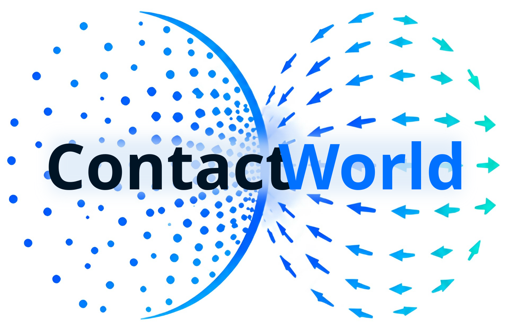

<div align="center">


<h2> ContactWorld: <br>
What Matters in Vision-Tactile World Models for Contact-Rich Manipulation</h2>

<a href="https://github.com/PokuangZhou/ContactWorld"></a>
<a href="https://github.com/PokuangZhou/ContactWorld"></a>
<a href="https://huggingface.co/datasets/Pokuang/ContactWorld/tree/main"></a>

</div>

<p align="center">
<a href="https://github.com/ZhangZhiyuanZhang?tab=repositories">Zhiyuan Zhang</a>*,
<a href="https://pokuangzhou.github.io/website/">Pokuang Zhou</a>*,
<a href="https://aaronzkd.github.io/KaidiZhang.web/">Kaidi Zhang</a>,
<a href="https://scholar.google.com/citations?user=A880yg0AAAAJ&hl=en&oi=ao">Adeesh Desai</a>,
<a href="https://scholar.google.com/citations?user=Lloa6s4AAAAJ&hl=en&oi=ao">Temitope Amosa</a>, et al.<br>
* Equal contribution. Supervisor: <a href="https://www.purduemars.com/people">Yu She</a>.
</p>

<p style="width: 90%; margin: 0 auto; text-align: justify;">
<strong>ContactWorld</strong> systematically studies vision-tactile world models across 12 contact-rich manipulation tasks and shows that spatially structured, temporally continuous representations are crucial for stable long-horizon planning. Experiments further demonstrate that point-cloud observations and compatible tactile force-field representations substantially improve planning success, highlighting the importance of representation structure, multimodal compatibility, and tactile sensing under long-horizon contact uncertainty.
</p>

<p align="center">

</p>

## Highlights

- A JEPA-structured vision-tactile world model with a CEM-style planner.
- We identify three key properties: spatial structure, temporal continuity, and cross-modal compatibility.
- Easy-to-install, reproducible, and lightweight simulation environments based on Isaac Gym.


## Easy Setup

Please read the patch helper's README first. The script will clone the required third-party repositories and download the necessary data after you confirm to proceed. Then, you can directly run the installation command.
Details can refer to [patch helper](scripts/manifeel_codepatch/readme.md).

This installation requires [mamba](https://mamba.readthedocs.io/en/latest/installation/mamba-installation.html). Please make sure mamba is installed before running the script.


```bash
bash install_cw.sh
```

## demo data and checkpoint download link
💾 [huggingface link](https://huggingface.co/datasets/Pokuang/ContactWorld/tree/main)

how to use those data please refer to [data helper](extract_dataset_ckpts_addto_README.md) 

## Repository Layout

```text
ContactWorld/
  config/                 # Training and evaluation YAML configs
  data/
    demo_data/            # Demo zarr datasets
    pretrained_model/     # Local pretrained checkpoints, e.g. DINOv3
    replace_part/         # Patch files applied to thirdparty ManiFeel repos
  media/                  # GIF used in README
  scripts/
    manifeel_codepatch/   # Install, data download, and thirdparty patch scripts
    train_tf_test.sh      # Minimal training/sanity test
    eval_planner_tf_test.sh # planner
```

## Quick Tests

Run a training smoke test. By default this uses the full demo dataset but only
runs Lightning's sanity-check path (`EPOCHS=0`):

```bash
scripts/train_tf_test.sh
```

Run one actual minimal training epoch:

```bash
EPOCHS=1 BATCH_SIZE=32 scripts/train_tf_test.sh
```

Run a minimal planner evaluation in IsaacGym:

```bash
scripts/eval_planner_tf_test.sh
```

The planner smoke test defaults to a very small setting:

```text
NUM_ENVS=2
MAX_STEPS=1
CANDIDATES=4
TOPK=2
ITERATIONS=1
```

## Training

Main DINO front-RGB training config:

```text
config/tf/train/dino/train_dino_front_rgb.yaml
```

The test script forwards any extra arguments to `world_model_tf/train.py`, so
you can override config values from the command line:

```bash
scripts/train_tf_test.sh \
  --epochs 2 \
  --batch-size 32 \
  --train-num-workers 8 \
  --val-num-workers 4
```

## Planner Evaluation

Planner evaluation config:

```text
config/tf/eval/dino/eval_planner_env_dino_front_rgb_smoke.yaml
```

The test script forwards extra arguments to `world_model_tf/eval_planner_env.py`:

```bash
scripts/eval_planner_tf_test.sh \
  --num-envs 4 \
  --max-steps 3 \
  --candidates 8 \
  --candidate-chunk-size 8 \
  --topk 2 \
  --iterations 1
```

## Addtion Information
ContactWorld/eval_planner_dy.py is for dynamic-horizon, and current default is fixed
ContactWorld/eval_planner_sorting.py is for sorting task (for addiiton case id needed)


## Citation
If you find our work useful, please consider citing our paper. 

```bibtex
@article{zhang2026contactworld,
  title={ContactWorld: What Matters in Vision-Tactile World Models for Contact-Rich Manipulation},
  author={Zhiyuan Zhang, Pokuang Zhou, Kaidi Zhang, Adeesh Mahesh Desai, Temitope Ibrahim Amosa, Davood Soleymanzadeh, Jiuzhou Lei, Minghui Zheng, and Yu She},
  journal={},
  year={2026}
}
```

Related work (Manifeel):

```bibtex
@article{luu2025manifeel,
  title={ManiFeel: Benchmarking and Understanding Visuotactile Manipulation Policy Learning},
  author={Luu, Quan Khanh and Zhou, Pokuang and Xu, Zhengtong and Zhang, Zhiyuan and Qiu, Qiang and She, Yu},
  journal={arXiv preprint arXiv:2505.18472},
  year={2025}
}
```
