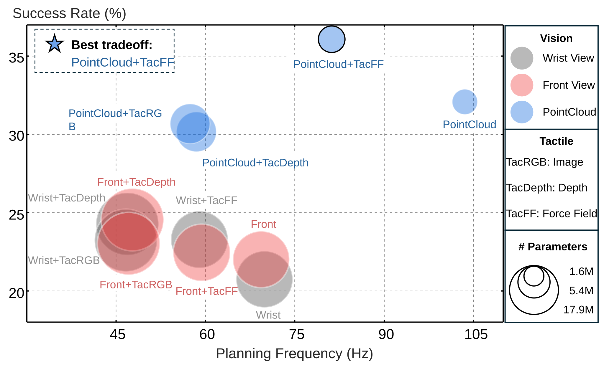

<div align="center">


<h2> ContactWorld: <br>
What Matters in Vision-Tactile World Models for Contact-Rich Manipulation</h2>

<a href="https://contact-world.github.io/"></a>
<a href="https://drive.google.com/file/d/15ToTrPhCByiSU59WxpiK-_ueZB6LVd8c/view"></a>
<a href="https://huggingface.co/datasets/Pokuang/ContactWorld/tree/main"></a>

</div>

<p align="center">
<a href="https://zhangzhiyuanzhang.github.io/personal_website/">Zhiyuan Zhang</a>*,
<a href="https://pokuangzhou.github.io/website/">Pokuang Zhou</a>*,
<a href="https://aaronzkd.github.io/KaidiZhang.web/">Kaidi Zhang</a>,
<a href="https://scholar.google.com/citations?user=A880yg0AAAAJ&hl=en&oi=ao">Adeesh Desai</a>,
<a href="https://scholar.google.com/citations?user=Lloa6s4AAAAJ&hl=en&oi=ao">Temitope Amosa</a>,
<br>
<a href="https://scholar.google.com/citations?user=Rmadq64AAAAJ&hl=en">Davood Soleymanzadeh</a>,
<a href="https://scholar.google.com/citations?user=X52xke0AAAAJ&hl=en">Jiuzhou Lei</a>,
<a href="https://zh.engr.tamu.edu/">Minghui Zheng</a>,
<a href="https://www.purduemars.com/">Yu She<sup>†</sup></a>
<br>
* Equal Contribution &nbsp; † Corresponding Author
</p>

<p style="width: 80%; margin: 0 auto; text-align: justify;">
<strong>ContactWorld</strong> is a benchmark for studying visual-tactile world models in contact-rich manipulation.
Across 12 tasks and 6 sensing modalities, ContactWorld reveals that representation structure, cross-modal compatibility, and long-horizon robustness are critical for reliable planning.
</p>

<p align="center">

</p>

## Highlights
- A JEPA-structured vision-tactile world model with a CEM-style planner.
- We reveal three key findings for contact-rich world modeling:
  - Representation structure matters.
  - Tactile benefits depend on cross-modal compatibility.
  - Tactile sensing becomes increasingly important at longer planning horizons.
- Easy-to-install and lightweight Isaac Gym environments covering 12 contact-rich manipulation tasks and 6 sensing modalities.
- Open-source datasets, pretrained checkpoints, and evaluation tools for reproducible research.


## Performance Overview
Beyond planning performance, ContactWorld also compares sensing modalities in terms of computational efficiency and model complexity.

The figure below summarizes the tradeoff between average success rate, planning frequency, and parameter count across all evaluated world models.

<p align="center">
  
</p>

**Key observations:**
- **PointCloud** achieves substantially higher success rates than image-based representations while running at the highest planning frequency.
- PointCloud-based models require only **1.6M–5.4M parameters**, compared with **14M+ parameters** for image-based alternatives.
- Adding tactile sensing further improves planning performance, with **PointCloud + TacFF** achieving the highest average success rate (**36.1%**) in simulation.
- The results suggest that structured geometric representations can provide both stronger planning performance and better computational efficiency.


## Easy Setup
ContactWorld can be installed with a single command:

```bash
bash install_cw.sh
```

The installation script automatically clones the required third-party repositories, creates the environment, and downloads the necessary assets.

**Note:** ContactWorld requires [mamba](https://mamba.readthedocs.io/en/latest/installation/mamba-installation.html). Please make sure mamba is installed before running the installation script.

## Demo Data and Checkpoint Download Link
💾 [huggingface link](https://huggingface.co/datasets/Pokuang/ContactWorld/tree/main)

how to use those data please refer to [data README](extract_dataset_ckpts_addto_README.md). 

## Repository Structure

```text
ContactWorld/
├── config/                    # Training and evaluation configs
├── dataset/
│   └── zarr_dataset.py        # Zarr dataset loader and temporal sampling
├── data/
│   ├── demo_data/             # Example datasets
│   └── replace_part/          # Patch files for ManiFeel
├── media/                     # README figures and GIFs
├── scripts/
│   └── manifeel_codepatch/    # Installation and patch scripts
├── thirdparty/                # External dependencies
│
├── architectures.py           # Vision, tactile, and predictor networks
├── jepa.py                    # JEPA world model implementation
├── losses.py                  # VC / IDM / SIM regularization losses
├── planner_utils.py           # CEM planner and model construction
│
├── train.py                   # World model training
├── eval_rollout.py            # Multi-step rollout error evaluation
├── eval_planner.py            # Contact-rich planning benchmark
├── eval_planner_sorting.py    # Sorting task evaluation
│
├── install_cw.sh             # One-click installation
└── README.md
```

## Training

We provide ready-to-run training scripts for all 12 ContactWorld tasks and modality combinations.

For example, to train a PointCloud-only world model on the USB insertion task:

```bash
bash config/training/insertion_usb/pc.sh
```

To train a PointCloud + TacFF world model:

```bash
bash config/training/insertion_usb/pc_ff.sh
```

Training scripts for all task–modality combinations are provided under:

```text
config/training/<task>/<modality>.sh
```

## Rollout Evaluation (Optional)

After training, the learned world model can be evaluated using multi-step rollout prediction.

This evaluation measures how prediction error accumulates as the rollout horizon increases and provides insight into long-horizon model quality.

We provide three rollout action modes:

- **GT Action** — rollout using ground-truth actions
- **Zero Action** — rollout using zero actions
- **Random Action** — rollout using random actions

The default rollout horizon is **6 steps**.

Rollout evaluation is useful for analyzing:

- Predictor action sensitivity
- Error accumulation over time
- Long-horizon prediction stability

## Released Checkpoints

Pretrained checkpoints for all task-modality combinations are provided.

To ensure fair comparison across sensing modalities, all released checkpoints are trained using the same budget of **100k training steps**. Because episode lengths differ across tasks, the corresponding number of epochs may vary.

## Planning Evaluation

ContactWorld evaluates world models through closed-loop planning using a CEM-based planner.

We provide four goal-offset settings: **12, 24, 36, and 48 steps**.

For each task, modality combination, and goal-offset horizon, we provide ready-to-run scripts.

For example, to evaluate a PointCloud-only world model on USB insertion with a 12-step goal offset:

```bash
bash config/planning/insertion_usb/12/pc.sh
```

To evaluate a PointCloud + TacFF world model:

```bash
bash config/planning/insertion_usb/12/pc_ff.sh
```

Planning scripts are organized as:

```text
config/planning/<task>/<goal_offset>/<modality>.sh
```

## Planning Outputs

After planning evaluation, ContactWorld automatically generates both quantitative metrics and qualitative visualizations.

### Quantitative Results

Planning statistics are saved to:

```text
metrics_summary.json
```

including:

- Success Rate
- Position Error
- Orientation Error
- Planning Cost
- Goal-Reaching Statistics

### Qualitative Visualizations

ContactWorld also generates rollout videos comparing:

```text
World Model Prediction
vs
Ground-Truth Observation
```

Example outputs:

```text
output_dir/
├── metrics_summary.json
└── media/
    ├── front_rollout_vs_gt_env000.mp4
    ├── pointcloud_rollout_vs_gt_env000.mp4
    ├── tactile_force_field_rollout_vs_gt_env000.mp4
    └── ...
```

These videos help diagnose prediction failures, contact reasoning errors, and long-horizon planning behavior.

## Addtion Information
ContactWorld/eval_planner_dy.py is for dynamic-horizon, and current default is fixed
ContactWorld/eval_planner_sorting.py is for sorting task (for addiiton case id needed)

Install details please refer to [patch helper's README](scripts/manifeel_codepatch/readme.md).

## Citation
If you find our work useful, please consider citing our paper. 

```bibtex
@article{zhang2026contactworld,
  title={ContactWorld: What Matters in Vision-Tactile World Models for Contact-Rich Manipulation},
  author={Zhang, Zhiyuan and Zhou, Pokuang and Zhang, Kaidi and Desai, Adeesh and Amosa, Temitope and Soleymanzadeh, Davood and Lei, Jiuzhou and Zheng, Minghui and She, Yu},
  journal={arXiv preprint},
  year={2026}
}
```

```bibtex
@article{luu2025manifeel,
  title={ManiFeel: Benchmarking and Understanding Visuotactile Manipulation Policy Learning},
  author={Luu, Quan Khanh and Zhou, Pokuang and Xu, Zhengtong and Zhang, Zhiyuan and Qiu, Qiang and She, Yu},
  journal={arXiv preprint arXiv:2505.18472},
  year={2025}
}
```

```bibtex
@article{saka2026contact,
  title={CONTACT: Contact-Aware Tactile Learning for Robotic Disassembly},
  author={Saka, Yosuke and Hu, Jyun-Chi and Desai, Adeesh and Zhang, Zhiyuan and Zhang, Bihao and Luu, Quan Khanh and Prince, Md Rakibul Islam and Zheng, Minghui and She, Yu},
  journal={arXiv preprint arXiv:2603.08560},
  year={2026}
}
```

## Acknowledgement

- ContactWorld is built upon the excellent open-source implementations of [EB-JEPA](https://github.com/facebookresearch/eb_jepa) and [Le-WM](https://github.com/lucas-maes/le-wm), which provided valuable foundations for our world model framework.